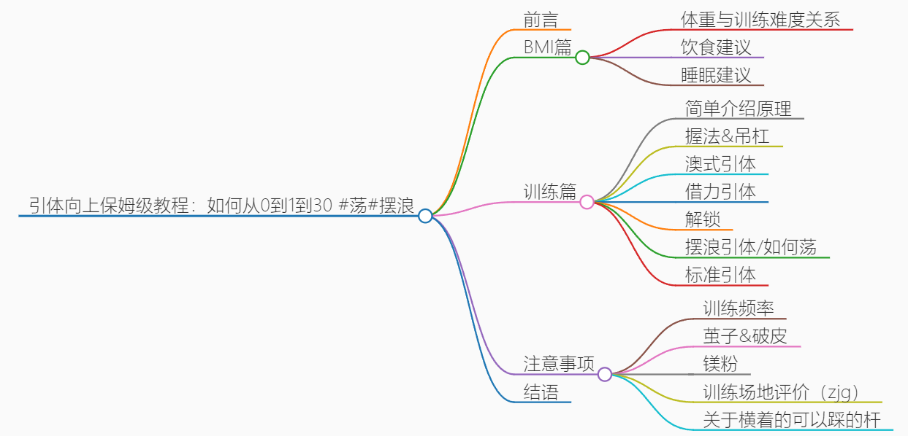
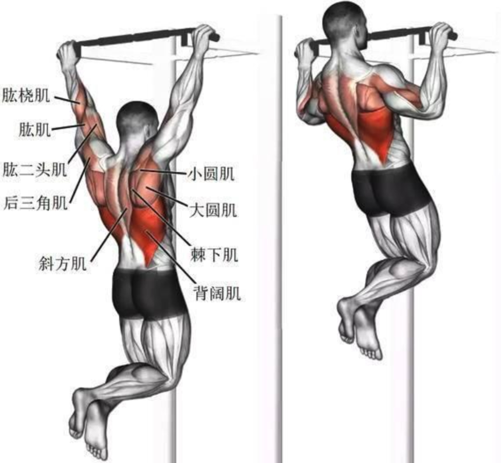
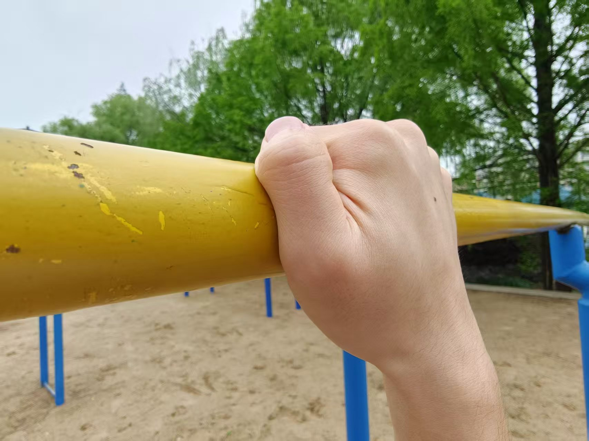
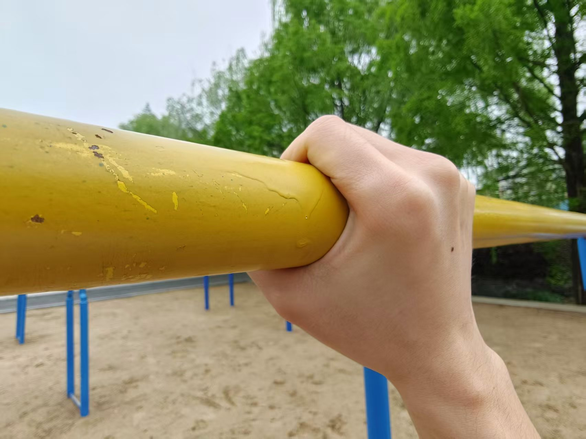
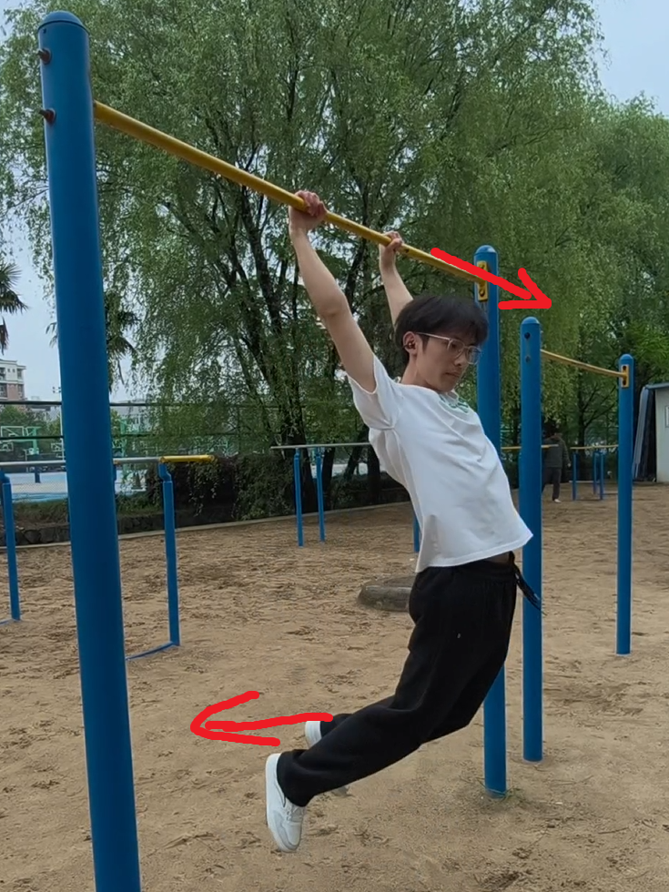
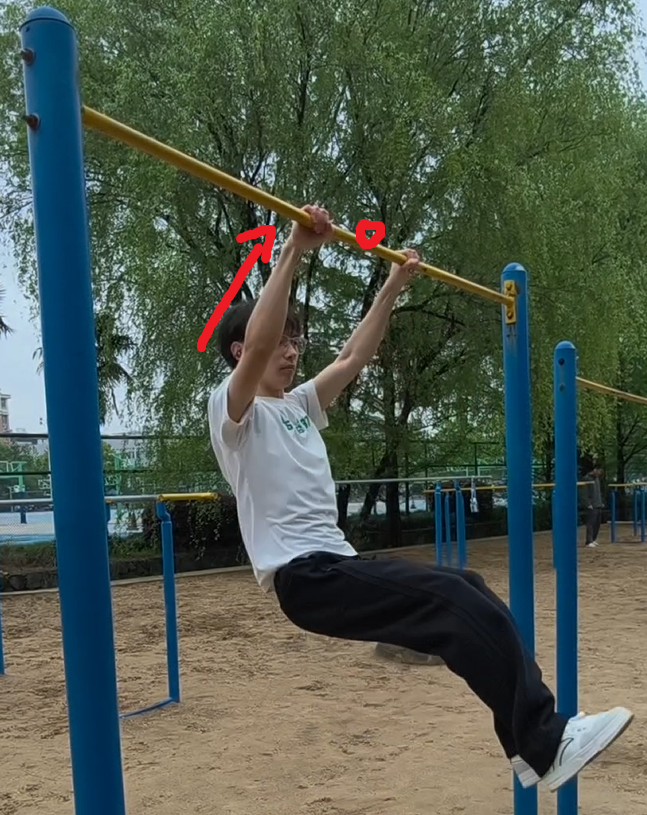
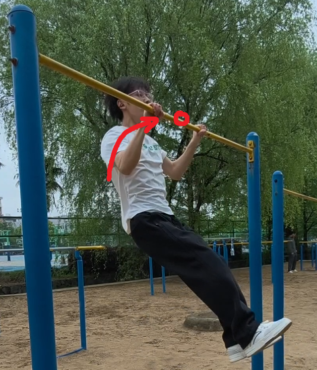
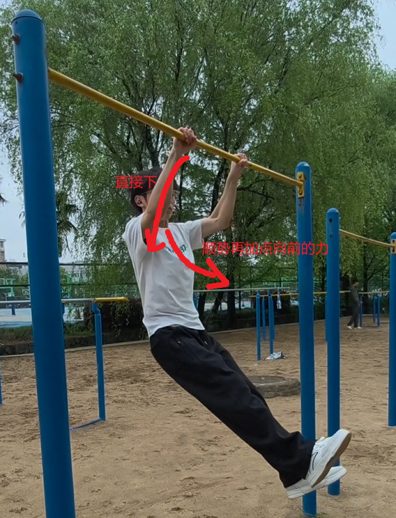

# 引体向上保姆级教程：如何从0到1到30    #荡#摆浪

## 前言

在同好的催促下写了此教程贴，虽然一拖再拖，但最终是完成了。

本文也详细讲解了**如何连贯地荡**  

*以下内容可能没有那么强的专业性和科学性，均有本人和同学的自身实践得出。如有错误，还望大家批评指正。*

本文大纲：

## BMI篇

### 体重与训练难度关系

个人认为是呈现**正态分布**的，过瘦和过重都不利于第一个引体向上的突破。

**对于过瘦：**重心放在<u>增肌</u>上，训练计划中<u>强化基础</u>部分的比例要加大，基础力量一定要打扎实

**对于过重：**重心放在<u>减重</u>上，训练计划多侧重<u>燃脂、减脂</u>（比如增加些跑步、游泳），控制高热量食物摄入

### 饮食建议

*（由于只是个引体教程贴，此处只粗略介绍）*

建议按照膳食宝塔来吃，同时增加**蛋白质**摄入（因为你已经开始训练了，要给肌肉一点养料）。

**对于过瘦**：少食多餐，一天可以吃4~5顿；多吃主食、蛋白质、优质脂肪（e.g.鸡蛋√海鲜√牛奶√蛋糕×油炸食品×）

**对于过重**：正常吃饭，保证身体所需。但要克制高油高糖高盐饮食（参考lz之前一两个月才喝一杯奶茶/去外面吃一顿）

### 睡眠建议

保证最少最少6小时的睡眠。睡得越好肌肉长得越快。

> 现在是真理解了为什么网上说高中最适合健身，因为作息太规律了利于长肌肉

## 训练篇

### 简单介绍原理

主要是**背阔肌**发力，**大圆肌**和**斜方肌**辅助；**肱二头肌**、**肱桡肌**、**腰腹**次要发力

所以我们主要重视这三个方面：**背部**、**小臂**、**握力**

- 训练时要去主动感受这方面肌肉的发力，主动尝试去用这部分肌肉发力将自己拉起来

为了便于大家制作训练计划，接下来将按照训练顺序讲述

### 握法&吊杠

**半握：**

**全握：**更推荐，更安全 -> 握紧了你甚至在单杠上怎么转圈都不会掉下来 -> 安全感可以让你更大胆地去发力

**吊杠：**顾名思义，就是练习吊在单杠上。

​	动作要领：挺胸，肩胛骨下沉、后收（不会也没关系哈哈）

​	5s为基础（建议先会这个再往后练），40s后无需再刻意训练（吊的久才能拉得多，参考lz去年体育课36个 - 1’50）

### 澳式引体

引体的退阶，引体完全拉不上去时就先练这个

<video src="image/澳式引体1.mp4" controls width="600"></video>

找一根横杆，双手**正握**，握距**略宽于肩**，手臂完全伸直，身体近似一条直线。

1. **启动（吸气）**：先夹紧肩胛骨，肩胛**下沉 + 后收**，勿耸肩。

2. **拉起（呼气）**：背阔肌发力，**胸找杠**，屈肘把身体拉向横杆；肘部**贴身体两侧**（别外展成 90°）。

3. **顶峰（停 1 秒）**：**下胸轻触横杆**，夹紧肩胛，感受中背部收缩。

4. **下放（吸气）**：**缓慢控制**（2–3 秒）伸直手臂，回到起始位，全程保持身体刚性。

脚越往前越难，进阶版类似：

<video src="image/澳式引体2.mp4" controls width="600"></video>

### 借力引体

*此时你离你的第一个引体已经不远了*

<video src="image/借力引体.mp4" controls width="600"></video>

核心在于先借助跳的力量，当你跳上去时手肘已经90%了，然后用力将自己拉上去——相当于直接做引体的后50%

### 解锁

借力引体每次只能做一个嘛（因为第二个你借不上力了，得重新起跳）。所以你就一个一个做，堆数量，数量堆多了自然就能解锁第一个引体了（姿势可能很丑，但这是正常的，后面力量上来了可以慢慢纠正姿势）

当你能不借助跳拉一个时，恭喜，你马上能成为一个引体大佬了。0到1是最难的部分。

### 摆浪引体/如何荡

<video src="image/荡.mp4" controls width="600"></video>

1. 头往前顶一下，脚往后摆

2. 身体往后到极限位置时顺势发力上拉

3. 下巴去找杠，下巴刚刚过杠就好（可以抬点头减少难度）

4. 顺着重力下来，同时加一点点向前的力，头往前顶腿往后甩，实现一轮循环。或者更“极端”些，直接往身体斜下方/前方 下来，直接靠重力进入循环

自此，你成功进入了**摆浪**的节奏中，保持稳定的呼吸，就可以顺畅、连贯地拉好多引体

运动轨迹：头   向前->向上->向下->向前

​                   腿   向后->向前     ->  向后

### 标准引体

摆浪终究是一个应试手段，对实力提升比较小，想要提升还是得练标准引体。

注意：体重过大者建议先练标准引体再摆浪

力量基础：5个摆浪引体

要点：沉肩，锁定背部，感觉背部发力

<video src="image/标准引体.mp4" controls width="600"></video>

## 注意事项

> Super小武：引体不需要过多地练肌肉，只需要激活那些已有的沉睡的肌肉

### 训练频率

**不要一天一练**，根据自己的身体适当休息。肌肉**酸痛**、**不适**时禁止训练！

### 茧子&破皮

过厚时可以考虑撕掉、用小刀割。里面都是死皮，不疼的。

破皮、出血后记得消毒。等完全好了再练。

### 镁粉

可以并推荐使用，成绩会upup

### 训练场地评价（zjg）

- 东操沙地：除了杆子较旧以外很夯
- 东操北：新建的，就是有点油+小幅度转动
- 东操南：就是有点“偏僻”
- 西操北：不错，偶尔油
- 西操南：用的人好少，但是很不错

### 关于横着的可以踩的杆

本质上还是澳式引体，但是更危险，个人不建议用。想助力不如借力引体，或者买个**<u>弹力带</u>**。

## 结语

引体不难，难的是走出舒适圈，去用这部分不常用的肌肉，去保持规律的训练。刚开始必然很痛苦，手要疼好几周。但万事开头难，熬过这段日子就行了。

推荐教程：b站搜索 Super小武，他是我的街健启蒙老师

前人经历（heavy）：【210斤高中生荡24个引体在高中生里面什么水平？】 https://b23.tv/CCO7cbw

前人经历（thin）：lz之前是根筷子，花了1个月能吊着，6个月从借力到第一个（走了许多弯路）

感谢@大早上帮我拍摄（本来想用动画演示的，但发现隔了三年已经不会用Blender了[ac01]）

第一次写教程贴，还不是很熟练。为了减少文字量，很多东西能少写点就少写点了。**如果有不详尽、没看懂的部分，欢迎在评论区提问。**若有错误和补充，欢迎大家支持。我将给每一个助力完善此教程贴的uu米米。